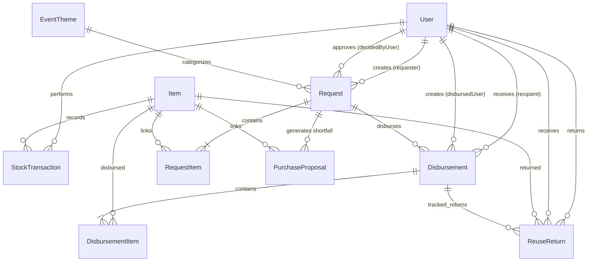
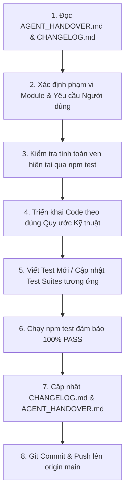

# 📘 TÀI LIỆU BÀN GIAO TOÀN DIỆN DỰ ÁN (AGENT HANDOVER & SYSTEM ARCHITECTURE)

> **⚠️ BẮT BUỘC DÀNH CHO AI AGENT KẾ TIẾP (MANDATORY INSTRUCTION FOR AGENTS):**  
> Khi bắt đầu phiên làm việc mới trên dự án này, Agent **BẮT BUỘC PHẢI ĐỌC TÀI LIỆU NÀY** cùng file [`CHANGELOG.md`](file:///D:/ABCRequest/CHANGELOG.md) trước khi tiến hành code. Mọi kiến trúc, luồng nghiệp vụ, cấu trúc bảng dữ liệu CSDL, phân quyền, API và quy ước kỹ thuật đều được ghi nhận chi tiết dưới đây để bạn tiếp tục phát triển ngay mà không cần đọc lại toàn bộ mã nguồn.

---

## 📑 MỤC LỤC
1. [Tổng Quan Dự Án & Bối Cảnh Nghiệp Vụ](#1-tổng-quan-dự-án--bối-cảnh-nghiệp-vụ)
2. [Sơ Đồ Cấu Trúc Mã Nguồn (Directory Tree & Architecture)](#2-sơ-đồ-cấu-trúc-mã-nguồn-directory-tree--architecture)
3. [Cơ Sở Dữ Liệu & Sơ Đồ Quan Hệ (Prisma Schema & Relations)](#3-cơ-sở-dữ-liệu--sơ-đồ-quan-hệ-prisma-schema--relations)
4. [Hệ Thống Phân Quyền 4 Cấp (4-Tier RBAC)](#4-hệ-thống-phân-quyền-4-cấp-4-tier-rbac)
5. [Toàn Bộ Các Phân Hệ & Nghiệp Vụ Cốt Lõi Đã Xây Dựng](#5-toàn-bộ-các-phân-hệ--nghiệp-vụ-cốt-lõi-đã-xây-dựng)
6. [Quy Ước Kỹ Thuật & Best Practices Trong Codebase](#6-quy-ước-kỹ-thuật--best-practices-trong-codebase)
7. [Quy Trình Làm Việc Chuẩn Dành Cho Agent (Agent Workflow & Checklist)](#7-quy-trình-làm-việc-chuẩn-dành-cho-agent-agent-workflow--checklist)
8. [Tài Khoản Mặc Định & Lệnh Vận Hành Hệ Thống](#8-tài-khoản-mặc-định--lệnh-vận-hành-hệ-thống)

---

## 1. TỔNG QUAN DỰ ÁN & BỐI CẢNH NGHIỆP VỤ

- **Tên dự án**: Hệ Thống Quản Lý Đồ Dùng Học Tập & Giáo Cụ Mầm Non (`kho-mam-non` / `ABCRequest`).
- **Mục tiêu chính**: Tin học hóa toàn diện quy trình xin cấp phát đồ dùng giảng dạy của giáo viên mầm non; tự động phân bổ tồn kho khả dụng theo thời gian thực; tự động tính toán kinh phí & sinh đề xuất mua sắm cho phần thiếu hụt; quản lý nhập kho, bàn giao cấp phát thực tế và thu hồi đồ dùng tái sử dụng.
- **Nguyên tắc nghiệp vụ cốt lõi**:
  1. **Ưu tiên kho nội bộ tuyệt đối**: Khi giáo viên tìm đồ dùng, hệ thống ưu tiên tối đa dữ liệu kho sẵn có trong trường trước khi cho phép tìm kiếm mở rộng / đề xuất món mới.
  2. **Toàn vẹn số liệu kho**: Mọi biến động xuất/nhập/cấp phát/hoàn trả đều phải qua `prisma.$transaction` và ghi nhật ký kiểm toán vào bảng `StockTransaction`.
  3. **Tự động phòng ngừa trùng lặp (Anti-Deduplication)**: Đảm bảo không tạo 2 mặt hàng trùng tên trong kho; tự động hợp nhất số lượng và giữ giá mới nhất.

---

## 2. SƠ ĐỒ CẤU TRÚC MÃ NGUỒN (DIRECTORY TREE & ARCHITECTURE)

```
D:\ABCRequest\
├── app\                                # Next.js App Router
│   ├── api\                            # Backend REST API Handlers
│   │   ├── auth\                       # Đăng nhập, đăng xuất, lấy user hiện tại (me)
│   │   ├── requests\                   # Tạo yêu cầu, danh sách, xuất Excel
│   │   │   └── [id]\                   # Chi tiết, approve (duyệt), reject (từ chối), export (Excel)
│   │   ├── purchase-proposals\         # Quản lý đề xuất mua hàng
│   │   │   ├── [id]\receive\           # Nhập kho từ đề xuất mua (POST/PATCH kèm cập nhật giá)
│   │   │   └── export\                 # Xuất biểu mẫu Excel Yêu Cầu Mua Sắm chuẩn
│   │   ├── disbursements\              # Phân hệ Cấp phát đồ dùng
│   │   │   ├── [id]\                   # Chi tiết phiếu cấp phát
│   │   │   └── direct\                 # Tạo phiếu cấp phát trực tiếp đồ trong kho (POST)
│   │   ├── reuse-returns\              # Phân hệ Thu hồi & Tái sử dụng đồ dùng (GET/POST)
│   │   ├── items\                      # CRUD kho đồ dùng (GET auto-deduplicate, POST anti-dup)
│   │   │   ├── [id]\                   # Sửa, xóa món đồ dùng
│   │   │   └── [id]\stock-in\          # Nhập kho thủ công có cập nhật giá (POST)
│   │   ├── search\                     # API Tìm kiếm
│   │   │   ├── items\                  # Tìm kiếm nội bộ 3 tầng (lib/search.ts)
│   │   │   └── external\               # Tìm kiếm mở rộng AI Gemini / Web (lib/external-search.ts)
│   │   ├── themes\                     # Quản lý chủ đề sự kiện (GET sort createdAt desc, POST)
│   │   ├── categories\                 # Quản lý danh mục loại đồ dùng (GET/POST)
│   │   ├── settings\                   # Cài đặt trường học, test AI (POST /test-ai)
│   │   ├── uploads\                    # Upload logo trường học (POST) & Serve ảnh tĩnh (GET)
│   │   └── users\                      # Lấy danh sách nhân sự / giáo viên phục vụ chọn người nhận
│   ├── requests\                       # UI: Danh sách yêu cầu (/requests) & Tạo mới (/requests/new)
│   ├── purchase-proposals\             # UI: Quản lý đề xuất mua sắm
│   ├── disbursements\                  # UI: Quản lý cấp phát đồ dùng (có nút Cấp phát trực tiếp)
│   ├── reuse-returns\                  # UI: Quản lý hoàn trả & tái sử dụng
│   ├── inventory\                      # UI: Bảng quản lý kho & Tồn kho thực tế
│   ├── admin\                          # UI Quản trị
│   │   ├── settings\                   # Cài đặt hệ thống: Thông tin trường, Logo, AI Gemini, Danh mục
│   │   └── users\                      # Quản lý danh sách tài khoản
│   ├── login\                          # UI: Trang đăng nhập
│   ├── layout.tsx                      # Root Layout tích hợp ToastProvider & SettingsProvider
│   └── page.tsx                        # Trang chủ Dashboard
├── components\                         # React Client & Server Components
│   ├── requests\                       # RequestForm, RequestList, ApproveModal, RejectModal
│   ├── purchase-proposals\             # PurchaseProposalList, ReceiveModal, ProposalFilterBar
│   ├── disbursements\                  # DisbursementModal, DisbursementVoucherModal, DirectDisbursementModal
│   ├── reuse-returns\                  # ReuseReturnModal, ReuseReturnVoucherModal
│   ├── inventory\                      # InventoryTable, ItemModal, StockInModal
│   ├── layout\                         # Navbar, Footer, Header
│   ├── common\                         # Toast, DatePicker (chuẩn tiếng Việt), ConfirmDialog
│   └── settings\                       # SettingsProvider, SchoolLogoUploader, AISettingsTab
├── lib\                                # Core Business Logic, Algorithms & Utilities
│   ├── db.ts                           # Prisma Client Singleton
│   ├── auth.ts                         # Hash mật khẩu (bcryptjs) & JWT Token (jose)
│   ├── auth-guards.ts                  # Middleware Guards: requireAuth, requireRole
│   ├── allocation.ts                   # Thuật toán phân bổ tồn kho khả dụng & pending hold
│   ├── search.ts                       # Động cơ tìm kiếm nội bộ 3 tầng (Exact, Trigram, Semantic)
│   ├── external-search.ts              # Động cơ tìm kiếm mở rộng AI Gemini 3.6 Flash + DuckDuckGo
│   ├── deduplicate-items.ts            # Động cơ tự động quét & hợp nhất món trùng lặp (mergeDuplicateItems)
│   ├── excel-logo.ts                   # Tiện ích 3-tier nhúng Logo trường vào file Excel
│   └── vietnamese-utils.ts             # Chuẩn hóa tiếng Việt không dấu, xóa ký tự đặc biệt
├── prisma\                             # Database Schema & Seed
│   ├── schema.prisma                   # Định nghĩa 11 Models SQLite/PostgreSQL
│   └── seed.ts                         # Dữ liệu mẫu khởi tạo chuẩn
├── data\                               # Cấu hình bền vững chống mất dữ liệu
│   └── system-settings.json            # Backup tự động cấu hình tên trường, logo, AI Key
├── public\                             # Tài nguyên tĩnh
│   └── uploads\                        # Thư mục lưu Logo trường học tải lên
├── tests\                              # Bộ kiểm thử tự động 22 test suites (100% PASS)
├── AGENTS.md                           # File chỉ dẫn bắt buộc cho AI Agent
└── CHANGELOG.md                        # Nhật ký chi tiết toàn bộ phiên bản
```

---

## 3. CƠ SỞ DỮ LIỆU & SƠ ĐỒ QUAN HỆ (PRISMA SCHEMA & RELATIONS)

Hệ thống quản lý 11 thực thể dữ liệu chính liên kết chặt chẽ:



### Chi tiết các Models chính:
1. **`User`**: `id`, `username`, `passwordHash`, `fullName`, `role` (`admin` | `manager` | `stocker` | `teacher`).
2. **`Item`**: `id`, `name`, `nameNormalized`, `category`, `unit`, `quantity` (tồn thật trong kho), `minStock`, `price` (đơn giá tham khảo/mua), `imageUrl`, `location`.
3. **`Request`**: `id`, `requesterId`, `purpose`, `neededDate`, `note`, `status` (`pending` | `approved` | `rejected` | `cancelled`), `disbursementStatus` (`cho_cap_phat` | `da_cap_phat` | `cap_phat_mot_phan`), `themeId`, `decidedBy`, `decidedAt`, `rejectReason`.
4. **`RequestItem`**: `id`, `requestId`, `itemId`, `requestedQty`, `allocatedQty`, `shortfallQty`, `status` (`approved` | `rejected`), `isNewItemProposal`, `proposedName`, `proposedUnit`, `proposedPrice`, `proposedImageUrl`, `proposedSourceUrl`.
5. **`PurchaseProposal`**: `id`, `sourceRequestId`, `itemId`, `proposedName`, `proposedUnit`, `qty`, `status` (`can_mua` | `da_dat_mua` | `da_nhap_kho`), `receivedQty`, `resolvedAt`.
6. **`StockTransaction`**: `id`, `itemId`, `type` (`nhap_kho` | `xuat_kho_duyet_yc` | `xuat_kho_cap_phat` | `nhap_tai_su_dung` | `dieu_chinh`), `quantityChange` (âm/dương), `referenceId`, `performedBy`, `note`.
7. **`Disbursement`**: `id`, `code` (`CP-YYYYMMDD-XXX`), `requestId`, `recipientId`, `disbursedBy`, `status` (`completed` | `partial`), `note`.
8. **`DisbursementItem`**: `id`, `disbursementId`, `itemId`, `itemName`, `itemUnit`, `disbursedQty`, `returnedQty`, `isReusable`.
9. **`ReuseReturn`**: `id`, `code` (`TSD-YYYYMMDD-XXX`), `disbursementId`, `itemId`, `returnedQty`, `condition` (`tot` | `kha` | `trung_binh`), `returnerId`, `returnerName`, `receivedBy`, `estimatedSavings`.
10. **`EventTheme`**: `id`, `name`, `icon`, `startDate`, `endDate`, `isActive`.
11. **`SystemSetting`**: `id`, `key`, `value`, `group`, `description`.

---

## 4. HỆ THỐNG PHÂN QUYỀN 4 CẤP (4-TIER RBAC)

Hệ thống phân quyền thông qua middleware `requireAuth` và `requireRole([...])`:

| Phân hệ / Chức năng | `admin` (Quản trị) | `manager` (Ban Giám Hiệu) | `stocker` (Thủ kho) | `teacher` (Giáo viên) |
|---|:---:|:---:|:---:|:---:|
| **Tạo Yêu Cầu Đồ Dùng** (`/requests/new`) | ✅ | ✅ | ✅ | ✅ |
| **Theo Dõi Yêu Cầu Của Mình** | ✅ | ✅ | ✅ | ✅ |
| **Duyệt / Từ Chối Toàn Đơn Hoặc Từng Món** | ✅ | ✅ | ❌ | ❌ |
| **Quản Lý Đề Xuất Mua Sắm & Xuất Excel** | ✅ | ✅ | ✅ | ❌ |
| **Nhập Kho Hàng Mua Về (Có Cập Nhật Giá)** | ✅ | ✅ | ✅ | ❌ |
| **Cấp Phát Đồ Dùng (Theo Phiếu & Trực Tiếp)** | ✅ | ✅ | ✅ | ❌ (Chỉ xem) |
| **Hoàn Trả & Tái Sử Dụng (Reuse)** | ✅ | ✅ | ✅ | ✅ (Yêu cầu trả) |
| **Quản Lý Kho & Nhập Kho Thủ Công** | ✅ | ✅ | ✅ | ❌ (Chỉ xem tồn) |
| **Cài Đặt Hệ Thống, AI Key, Upload Logo** | ✅ | ❌ | ❌ | ❌ |
| **Quản Lý Danh Sách Tài Khoản User** | ✅ | ❌ | ❌ | ❌ |

---

## 5. TOÀN BỘ CÁC PHÂN HỆ & NGHIỆP VỤ CỐT LÕI ĐÃ XÂY DỰNG

### 1. Phân Hệ Tạo Yêu Cầu Đồ Dùng (`/requests/new`)
- **Tìm kiếm đồ dùng nội bộ**: Tra cứu tức thì từ kho trường học với độ trễ < 50ms.
- **Tìm kiếm mở rộng bằng AI Gemini 3.6 Flash / Internet**: Tự động nhận diện ĐVT chuẩn mầm non, hình ảnh và khoảng giá thị trường VNĐ khi kho trường không có.
- **Bảng đồ dùng được chọn**: Có sẵn cột **`Đơn giá (VNĐ)`** (cho phép cô giáo chỉnh sửa giá tham khảo) và **`Thành tiền`** ($SL \times Đơn\ giá$).
- **Thanh Tổng Hợp Tạm Tính (Temporary Summary Bar)**: Tự động tính toán tổng số món, tổng SL xin (phân tách: *Kho cấp sẵn* vs *Cần mua mới*) và **Tổng kinh phí tạm tính (VNĐ)**.

### 2. Phân Hệ Duyệt Yêu Cầu (`/requests`)
- **Chip Dự toán kinh phí**: Hiển thị `🧮 Dự toán kinh phí: xxx,xxx đ` ngay trên tiêu đề thẻ yêu cầu giúp Ban Giám Hiệu nắm bắt ngân sách tức thì.
- **Bảng chi tiết đơn hàng**: Hiển thị rõ `Đơn giá (VNĐ)` và `Thành tiền` của từng món.
- **Duyệt loại trừ từng món**: Quản lý có thể bấm "Từ chối" một món lẻ; hệ thống tự động gạch ngang món đó, không trừ kho, không sinh đề xuất mua và **tự động giảm trừ kinh phí tương ứng khỏi tổng dự toán**.
- **Chân bảng tổng cộng (`tfoot`)**: Thống kê tổng số món hợp lệ, tổng SL, tổng kinh phí và tách riêng khoản *Kinh phí mua sắm phát sinh*.

### 3. Phân Hệ Quản Lý Đề Xuất Mua Sắm (`/purchase-proposals`)
- **Gộp theo Chủ đề / Sự kiện hoặc Mặt hàng**: Hiển thị trực quan mặt hàng nào cần mua, cho lớp nào, kinh phí dự kiến bao nhiêu.
- **Xuất Biểu Mẫu Excel Yêu Cầu Mua Sắm**: Thiết kế chuẩn font Times New Roman, màu Emerald/Dark Teal, dòng tổng cộng viền đôi chuẩn kế toán, khối ký tên đa cột không bị cắt chữ và **tự động nhúng Logo trường học**.
- **Nhập kho hàng mua về có nhập giá thực tế ([`ReceiveModal.tsx`](file:///D:/ABCRequest/components/purchase-proposals/ReceiveModal.tsx))**: Cho phép nhập số lượng thực nhận và **Đơn giá mua thực tế**, tự động tính tổng tiền nhập ($SL \times Đơn\ giá$) và cập nhật vào CSDL.

### 4. Động Cơ Chống Trùng Lặp Mặt Hàng Kho ([`lib/deduplicate-items.ts`](file:///D:/ABCRequest/lib/deduplicate-items.ts))
- **Ngăn chặn trùng lặp**: Khi nhập kho từ đề xuất mua hoặc tạo thủ công, hệ thống tự động kiểm tra tên / tên chuẩn hóa; nếu đã có trong kho $\rightarrow$ tự động **cộng dồn số lượng** và **cập nhật đơn giá mới nhất**, không sinh dòng mới.
- **Tự động quét & hợp nhất (Auto-Deduplication)**: Chạy ngầm khi tải `/api/items`, tự động gộp các bản ghi cũ bị trùng, chuyển toàn bộ khóa ngoại lịch sử và xóa bản ghi thừa.

### 5. Phân Hệ Cấp Phát Đồ Dùng (`/disbursements`)
- **Cấp phát theo phiếu yêu cầu đã duyệt**: Bàn giao số lượng đồ dùng có sẵn trong kho cho giáo viên, in biên bản cấp phát.
- **Tạo phiếu cấp phát trực tiếp đồ dùng trong kho ([`DirectDisbursementModal.tsx`](file:///D:/ABCRequest/components/disbursements/DirectDisbursementModal.tsx))**:
  - Dành cho Quản lý / Thủ kho xuất kho bàn giao đồ dùng sẵn có ngay tại kho.
  - Chọn người nhận, nhập mục đích / sự kiện, chọn đồ dùng (chỉ hiển thị món có tồn kho $> 0$), khống chế không cho xuất vượt quá tồn kho.
  - Tự động trừ kho, ghi `StockTransaction`, sinh mã `CP-YYYYMMDD-XXX` và mở ngay **Biên bản bàn giao** để in/ký nhận.

### 6. Phân Hệ Hoàn Trả & Tái Sử Dụng (`/reuse-returns`)
- Thu hồi các đồ dùng có tính chất sử dụng nhiều lần (`isReusable: true`) sau khi kết thúc sự kiện.
- Ghi nhận tình trạng đồ dùng (`Tốt`, `Khá`, `Trung bình`), nhập lại số lượng vào kho và tính toán số tiền tiết kiệm được cho nhà trường.

### 7. Upload Logo Trường & Nhúng Báo Cáo Excel ([`lib/excel-logo.ts`](file:///D:/ABCRequest/lib/excel-logo.ts))
- Upload logo trực tiếp dạng ảnh (`PNG`, `JPG`, `WEBP`, `SVG`) lưu trong `public/uploads/` và `SystemSetting`.
- Cơ chế 3 tầng tự phục hồi (DB $\rightarrow$ JSON $\rightarrow$ file gần nhất) đảm bảo logo luôn được nhúng vào góc trên bên trái của file Excel xuất ra.

---

## 6. QUY ƯỚC KỸ THUẬT & BEST PRACTICES TRONG CODEBASE

1. **Next.js 16 App Router**:
   - Mọi route API phải export hàm viết hoa: `export const GET = ...`, `export const POST = ...`.
   - Khi frontend gọi `fetch(..., { method: "POST" })`, API bắt buộc phải export `POST`.
2. **Quản trị Transaction & Tính Toàn Vẹn**:
   - Mọi thao tác cập nhật kho hoặc tạo dữ liệu đa bảng liên quan phải đặt trong `await prisma.$transaction(async (tx) => { ... })`.
3. **Định Dạng Tiền Tệ & Ngày Tháng**:
   - Tiền tệ: `(amount || 0).toLocaleString("vi-VN") + " đ"`.
   - Ngày tháng: `new Date(d).toLocaleDateString("vi-VN")` (`DD/MM/YYYY`).
4. **Chuẩn Hóa Tên Tiếng Việt**:
   - Luôn cập nhật trường `nameNormalized` khi tạo/sửa Item bằng hàm `normalizeVietnamese(name)` từ `lib/search.ts` để phục vụ tìm kiếm không dấu.
5. **Đồng Bộ Cấu Hình Hệ Thống**:
   - Các cấu hình trong `SystemSetting` luôn được ghi đồng thời ra `data/system-settings.json` để chống mất dữ liệu khi chuyển đổi môi trường hoặc chạy seed.

---

## 7. QUY TRÌNH LÀM VIỆC CHUẨN DÀNH CHO AGENT (AGENT WORKFLOW & CHECKLIST)

Khi nhận yêu cầu mới từ người dùng, Agent tiếp theo cần thực hiện nghiêm ngặt quy trình sau:



### ✅ Bảng Checklist Bắt Buộc Trước Khi Bàn Giao:
- [ ] Chạy `npm test` thành công **100% PASS** (hiện tại: 89/89 tests trên 22 suites).
- [ ] Đảm bảo không tạo thêm dòng mặt hàng trùng lặp trong kho.
- [ ] Đảm bảo mọi giao dịch kho đều ghi nhận vào `StockTransaction`.
- [ ] Đã ghi chú nội dung nâng cấp vào `CHANGELOG.md`.
- [ ] Đã chạy `git push origin main` và gửi kèm lệnh cập nhật Server Ubuntu (`git pull origin main && npm run build && pm2 restart all`) cho người dùng.

---

## 8. TÀI KHOẢN MẶC ĐỊNH & LỆNH VẬN HÀNH HỆ THỐNG

### Tài khoản đăng nhập hệ thống:
| Tài khoản (Username) | Mật khẩu (Password) | Vai trò (Role) | Chức năng chính |
|---|---|---|---|
| **`admin`** | `admin123` | `admin` | Quản trị toàn quyền, Cài đặt trường, AI Key, User |
| **`quanly`** | `quanly123` | `manager` | Ban Giám Hiệu: Duyệt đơn, Quản lý kho, Cấp phát |
| **`thukho`** | `thukho123` | `stocker` | Thủ kho: Nhập kho, Cấp phát đồ dùng, Đề xuất mua |
| **`giaovien`** | `giaovien123` | `teacher` | Giáo viên: Tạo yêu cầu, Tra cứu tồn kho, Hoàn trả |

### Các lệnh vận hành:
- **Chạy môi trường phát triển**: `npm run dev` (mặc định cổng `http://localhost:3000`)
- **Chạy toàn bộ bộ kiểm thử tự động (22 test suites)**:
  ```bash
  npm test
  ```
- **Chạy migrate CSDL**: `npx prisma migrate dev`
- **Khởi tạo / nạp lại dữ liệu mẫu**: `npx prisma db seed`
- **Lệnh cập nhật và Restart trên Server Production (Ubuntu)**:
  ```bash
  git pull origin main
  npm run build
  pm2 restart all
  ```

---
*Tài liệu được khởi tạo và cập nhật tự động — Phiên bản hệ thống: 1.4.0 (Đạt chuẩn 89/89 Tests).*
