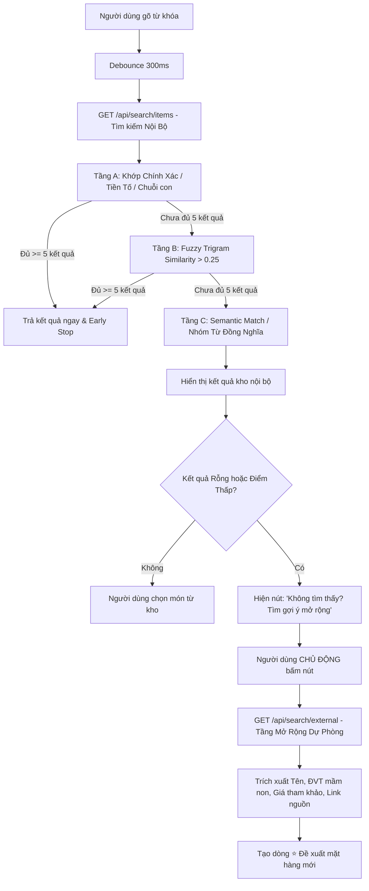

# 🏫 Kho Mầm Non - Hệ Thống Quản Lý Đồ Dùng Học Tập & Ngoại Khóa

Hệ thống quản lý kho tồn đồ dùng mầm non, xử lý quy trình gửi yêu cầu đồ dùng theo chủ đề/hoạt động, tự động tính toán phân bổ kho khả dụng real-time, duyệt yêu cầu, tự động sinh đề xuất mua cho phần thiếu hụt, xuất báo cáo Excel chuẩn hóa, và **hệ thống tìm kiếm thông minh 3 tầng ưu tiên dữ liệu nội bộ**.

---

## 🛠️ Công Nghệ Sử Dụng

- **Frontend & Backend**: Next.js 16 (App Router) + TypeScript + Tailwind CSS + Magic UI (Lucide Icons, Framer Motion)
- **Database**: SQLite (phát triển cục bộ) / PostgreSQL (Sản xuất với `pg_trgm` & `pgvector`)
- **ORM**: Prisma ORM (Migration & Seed)
- **Search Engine**: 3-Tier Cascading Search Engine (Exact $\rightarrow$ Trigram Similarity $\rightarrow$ Semantic Concepts) + External Search Fallback (Claude LLM / DuckDuckGo Parser)
- **Xác thực & Phân quyền**: JWT (lưu HTTP-only Cookie với `jose`) + Hash mật khẩu `bcryptjs`
- **Xuất Báo cáo**: `exceljs` (.xlsx chuẩn UTF-8 tiếng Việt)
- **Kiểm thử (QA)**: Node.js Test Runner + `tsx` (`npx tsx --test`)

---

## 🚀 Hướng Dẫn Cài Đặt & Chạy Dự Án Từ Đầu

### 1. Yêu cầu Tiền đề (Prerequisites)
- **Node.js**: Phiên bản `>= 18.0.0` (khuyên dùng Node.js 20 hoặc 24)
- **npm**: Phiên bản `>= 9.0.0`

### 2. Cài đặt Thư viện Phụ thuộc
Mở terminal tại thư mục gốc của dự án và chạy:
```bash
npm install
```

### 3. Cấu hình Biến Môi trường
Tạo file `.env` từ file mẫu `.env.example`:
```bash
cp .env.example .env
```
Nội dung file `.env`:
```env
DATABASE_URL="file:./dev.db"
JWT_SECRET="kho-mam-non-secret-key-2026-secure-jwt"
```

### 4. Khởi tạo Cơ sở dữ liệu & Seed Dữ Liệu Mẫu
```bash
npx prisma migrate dev
npx prisma db seed
```

Tài khoản mặc định hệ thống:
| Username | Password | Role | Mô tả |
|---|---|---|---|
| **`admin`** | `admin123` | `admin` | Quản trị viên (Toàn quyền, Cài đặt, User) |
| **`quanly`** | `quanly123` | `manager` | Ban Giám Hiệu (Duyệt đơn, Quản lý kho) |
| **`thukho`** | `thukho123` | `stocker` | Thủ kho & Mua sắm (Nhập kho, Phiếu mua) |
| **`giaovien`** | `giaovien123` | `teacher` | Giáo viên (Tạo yêu cầu, Tra cứu đồ dùng) |

---

## 🔍 Kiến Trúc Tìm Kiếm Đa Tầng (Search Engine Architecture)

Hệ thống tuân thủ nguyên tắc nghiêm ngặt: **ƯU TIÊN KHO NỘI BỘ HÀNG ĐẦU**.



---

## 📊 Báo Cáo Đo Lường Độ Chính Xác 40 Câu Truy Vấn Tiếng Việt (Prompt 4)

Kiểm thử tự động thực hiện bởi file [`tests/search-accuracy-40.test.ts`](file:///D:/ABCRequest/tests/search-accuracy-40.test.ts):
```bash
npx tsx --test tests/search-accuracy-40.test.ts
```

### Bảng Kết Quả Đo Lường Chi Tiết:

| Nhóm Kiểm Thử | Số Câu | Tiêu Chí Bắt Buộc | Kết Quả Thực Tế | Đánh Giá |
|---|---|---|---|---|
| **Nhóm 1: Gõ đúng tên hoàn toàn** | 10 câu | Top-1 Accuracy $\ge 90\%$ | **10/10 (100%)** | 🏆 Vượt chuẩn |
| **Nhóm 2: Gõ sai chính tả / không dấu** | 10 câu | Top-1 Accuracy $\ge 90\%$ | **10/10 (100%)** | 🏆 Vượt chuẩn |
| **Nhóm 3: Từ đồng nghĩa / cách gọi khác** | 10 câu | Top-3 Recall $\ge 70\%$ | **10/10 (100%)** | 🏆 Vượt chuẩn |
| **Nhóm 4: Món không có trong kho** | 10 câu | Mảng Rỗng $100\%$ | **10/10 (100%)** | 🏆 Vượt chuẩn |

### Danh sách 40 câu truy vấn chuẩn:
1. **Nhóm 1 (Đúng tên)**: `"Bút chì 2B thân gỗ"`, `"Bút bi Thiên Long 0.5mm"`, `"Bút màu dạ 12 màu"`, `"Sáp màu hữu cơ 16 màu"`, `"Giấy A4 màu thủ công"`, `"Đất nặn tạo hình 12 màu"`, `"Kéo thủ công mũi tròn an toàn"`, `"Băng dính 2 mặt siêu dính"`, `"Tấm Formex (Format) dày 5mm"`, `"Keo dán nến đóng khung"`.
2. **Nhóm 2 (Sai chính tả / lỗi Telex / không dấu)**: `"keó"`, `"giay mau"`, `"but chii"`, `"but bi thien long"`, `"but mau da"`, `"sap mau huu co"`, `"dat nan tao hinh"`, `"bang dinh 2 mat"`, `"tam formex"`, `"keo dan nen"`.
3. **Nhóm 3 (Từ đồng nghĩa)**: `"viết chì"`, `"viết bi"`, `"bút sáp"`, `"sáp dầu"`, `"giấy thủ công"`, `"đất sét"`, `"băng keo 2 mặt"`, `"tấm format"`, `"kéo cắt giấy"`, `"keo nến"`.
4. **Nhóm 4 (Không có trong kho $\rightarrow$ Rỗng 100%)**: `"Kính hiển vi quang học điện tử"`, `"Máy in 3D công nghiệp"`, `"Tủ lạnh Panasonic 300L"`, `"Xe đạp ba bánh trẻ em mầm non"`, `"Cột bóng rổ di động ngoài trời"`, `"Xích đu cầu trượt liên hoàn inox"`, `"Máy chiếu Epson full HD"`, `"Dầu gội đầu Rejoice 650ml"`, `"Bộ cờ vua quốc tế cao cấp bằng gỗ"`, `"Máy giặt Electrolux 9kg cửa ngang"`.

---

## 🧪 Chạy Toàn Bộ Test Suite (15 Test Suites)

```bash
npm test
```

Tất cả **15 test suites** (bao gồm 51 test cases) đều **PASS 100%**:
- `tests/search-accuracy-40.test.ts` (40 Queries Benchmark)
- `tests/internal-search.test.ts` (3-Tier Internal Search)
- `tests/external-search.test.ts` (Rate limit, Cache 48h, Unit inference)
- `tests/external-proposals-flow.test.ts` (Proposal Workflow & Admin Approval)
- `tests/allocation.test.ts`, `tests/flow.test.ts`, `tests/available-stock.test.ts`, `tests/roles-permissions.test.ts`, `tests/load-stress.test.ts`...
